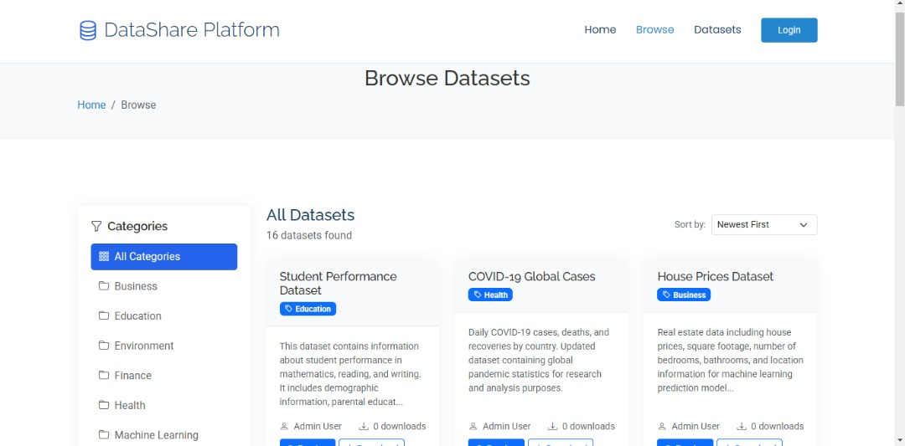

# Academic Data Repository

[](https://php.net)
[](https://mysql.com)
[](LICENSE)
[]()

> **A comprehensive web-based platform designed for educational institutions to facilitate collaborative data projects between faculty and students.**

<p align="center">
  
  
</p>

## 🎓 Project Overview

**Academic Data Repository** is a specialized platform developed for **Takoradi Technical University** that enables secure file sharing, version control, and project management capabilities specifically tailored for academic research and data analysis. The platform bridges the gap between faculty research initiatives and student learning outcomes through structured collaboration.


## 📁 Project Structure

```
academic-data-repository
├── config/
│   ├── config.php              # Main configuration
│   └── database.php            # Database connection
├── database/
│   ├── schema.sql              # Database schema
│   ├── migrations.sql          # Database migrations
│   └── sample_data_schema.sql  # Sample data
├── includes/
│   ├── auth.php               # Authentication system
│   ├── functions.php          # Utility functions
│   └── footer.php             # Common footer
├── uploads/                   # File upload directory
├── versions/                  # Version control storage
├── vendor/                    # Composer dependencies
│   └── phpoffice/phpspreadsheet/  # Excel processing library
├── assets/                    # Static assets (CSS, JS, images)
├── image/                     # Platform images
├── index.php                  # Main homepage
├── login.php                  # Login page
├── register.php               # Registration page
├── dashboard.php              # User dashboard
├── admin.php                  # Admin dashboard
├── upload.php                 # File upload system
├── preview.php                # File preview system
├── projects.php               # Projects listing
├── project.php                # Individual project view
├── create-project.php         # Project creation
├── review.php                 # Review system
├── autoload.php               # Custom autoloader
└── README.md                  # This file
```


## 📄 License

This project is licensed under the **MIT License** - see the [LICENSE](LICENSE) file for details.


## 📚 Academic Context

This platform is specifically designed for **African academic institutions**, with particular focus on:
- **Ghanaian educational context**
- **Faculty-student collaboration patterns**
- **Research workflow requirements**
- **Educational outcome tracking**
- **Institutional integration needs**


---

**🎓 Academic Data Repository** - Empowering educational institutions with collaborative data management tools.

**Powered by TTU** | © 2025 Takoradi Technical University. All rights reserved.
